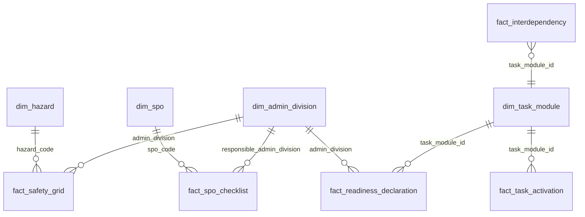

# Model danych


Dokument jest słownikiem danych dla całego repozytorium. Wszystkie rekordy są syntetyczne, kodowane UTF-8, deterministyczne (`seed=42`) i zgodne z konwencją: nazwy techniczne po angielsku bez polskich znaków, treść opisowa po polsku. Dane wygenerowane mają następujące wolumeny: `dim_hazard.csv`: 20,
`dim_admin_division.csv`: 25,
`dim_task_module.csv`: 7,
`fact_safety_grid.csv`: 1000,
`dim_spo.csv`: 16,
`fact_spo_checklist.csv`: 64,
`dim_contact_point.csv`: 25,
`fact_readiness_declaration.jsonl`: 106,
`fact_task_activation.jsonl`: 79,
`fact_interdependency.csv`: 7,.

## Diagram relacji



## Logika realizmu przypisań

Przypisania w `fact_safety_grid` nie są losowe. Dla każdego zagrożenia zdefiniowano profil kompetencyjny: działy wiodące, współpracujące i wspierające oraz moduły typowe dla fazy `R` lub `O`. Przykład: dla `Z02 Powódź` w fazie reagowania rolę wiodącą mają `VIII Gospodarka wodna` i `XIX Sprawy wewnętrzne`, bo powódź wymaga hydrologii, zarządzania wodami, PSP/Policji i koordynacji bezpieczeństwa. Współpracują `IV Energia`, `IX Zdrowie`, `XIII Łączność`, `XIV Obrona narodowa`, `XXII Transport`, `XXIII Zabezpieczenie społeczne` i `XXIV Klimat`. W fazie odbudowy rośnie rola `II Budownictwo` i `XXII Transport`, bo kluczowe stają się szkody, mosty, drogi, mieszkalnictwo i infrastruktura.

Analogicznie: epidemia wzmacnia `IX Zdrowie`, cyber i teleinformatyka wzmacniają `X Informatyzacja` oraz `XIII Łączność`, epizootia i epifitoza wzmacniają `XVII Rolnictwo`, katastrofa morska wzmacnia `VII Gospodarka morska`, działania hybrydowe i terroryzm wzmacniają `XIX`, `XIV`, `X`, `XX` i `XVIII`. Dzięki temu macierz ma kompletne 1000 komórek, ale jednocześnie zachowuje merytoryczną strukturę kompetencyjną.


## `dim_hazard.csv`

**Opis:** Słownik 20 zagrożeń KPZK Z01–Z20 z kategorią, prawdopodobieństwem, skutkami, wynikiem ryzyka i kolorem matrycy.

**Ziarno:** `hazard_code`  
**Liczba rekordów:** 20

| Kolumna | Typ | Opis | Przykład | Dopuszczalne wartości |
|---|---|---|---|---|
| `hazard_code` | string | Kod zagrożenia KPZK. | `Z01` | Z01–Z20 |
| `hazard_name` | string | Nazwa zagrożenia. | `Epidemia` | lista kanoniczna KPZK |
| `category` | string | Kategoria zagrożenia. | `społeczne` | naturalne; techniczne; społeczne; hybrydowe |
| `probability` | integer | Prawdopodobieństwo w skali 1–5. | `3` | 1–5 |
| `probability_label` | string | Opis prawdopodobieństwa. | `możliwe` | bardzo rzadkie; rzadkie; możliwe; prawdopodobne; bardzo prawdopodobne |
| `impact` | integer | Skutki w skali 1–5. | `5` | 1–5 |
| `impact_label` | string | Opis skutków. | `katastrofalne` | nieistotne; małe; średnie; duże; katastrofalne |
| `risk_score` | integer | Iloczyn prawdopodobieństwa i skutków. | `15` | 1–25 |
| `risk_level` | string | Poziom ryzyka wyliczony z risk_score. | `wysokie` | niskie; podwyższone; wysokie; krytyczne |
| `color` | string | Kolor matrycy ryzyka. | `czerwony` | zielony; żółty; czerwony; brązowy/krytyczny |

**Przykładowy rekord:**

```csv
hazard_code,hazard_name,category,probability,probability_label,impact,impact_label,risk_score,risk_level,color
Z01,Epidemia,społeczne,3,możliwe,5,katastrofalne,15,wysokie,czerwony
```


## `dim_admin_division.csv`

**Opis:** Słownik 25 działów administracji rządowej I–XXV wraz z ministerstwem i syntetyczną listą instytucji podległych.

**Ziarno:** `admin_division`  
**Liczba rekordów:** 25

| Kolumna | Typ | Opis | Przykład | Dopuszczalne wartości |
|---|---|---|---|---|
| `admin_division` | string | Numer katalogowy działu administracji. | `I` | I–XXV |
| `admin_name` | string | Nazwa działu administracji. | `Administracja publiczna` | kanoniczna lista 25 działów |
| `ministry` | string | Ministerstwo odpowiedzialne za dział. | `Minister Spraw Wewnętrznych i Administracji` | tekst |
| `subordinate_institutions` | string | Syntetyczna lista instytucji podległych lub współpracujących. | `RCB; wojewodowie; administracja zespolona` | tekst rozdzielony średnikami |

**Przykładowy rekord:**

```csv
admin_division,admin_name,ministry,subordinate_institutions
I,Administracja publiczna,Minister Spraw Wewnętrznych i Administracji,RCB; wojewodowie; administracja zespolona
```


## `dim_task_module.csv`

**Opis:** Słownik 7 modułów zadaniowych używanych w siatce bezpieczeństwa i aplikacji.

**Ziarno:** `task_module_id`  
**Liczba rekordów:** 7

| Kolumna | Typ | Opis | Przykład | Dopuszczalne wartości |
|---|---|---|---|---|
| `task_module_id` | integer | Identyfikator modułu zadaniowego. | `1` | 1–7 |
| `task_module_name` | string | Nazwa modułu zadaniowego. | `Monitorowanie i ostrzeganie` | lista 7 modułów |
| `description` | string | Opis znaczenia modułu. | `Monitoring zagrożenia, prognozy, komunikaty ostrzegawcze, obieg meldunków i dyżury.` | tekst |

**Przykładowy rekord:**

```csv
task_module_id,task_module_name,description
1,Monitorowanie i ostrzeganie,Monitoring zagrożenia, prognozy, komunikaty ostrzegawcze, obieg meldunków i dyżury.
```


## `fact_safety_grid.csv`

**Opis:** Kanoniczna macierz dział administracji × zagrożenie × faza R/O z listą modułów, rolą i krytycznością.

**Ziarno:** `hazard_code + admin_division + phase`  
**Liczba rekordów:** 1000

| Kolumna | Typ | Opis | Przykład | Dopuszczalne wartości |
|---|---|---|---|---|
| `hazard_code` | string | Kod zagrożenia KPZK. | `Z01` | Z01–Z20 |
| `admin_division` | string | Numer katalogowy działu administracji. | `I` | I–XXV |
| `phase` | string | Faza siatki bezpieczeństwa. | `R` | R; O |
| `task_modules` | string | Lista modułów przypisana do komórki siatki. | `1;2;4;7` | numery rozdzielone średnikami |
| `role` | string | Rola działu w komórce siatki. | `współpracujący` | wiodący; współpracujący; wspierający |
| `criticality` | string | Krytyczność odpowiedzialności. | `średnia` | niska; średnia; wysoka |

**Przykładowy rekord:**

```csv
hazard_code,admin_division,phase,task_modules,role,criticality
Z01,I,R,1;2;4;7,współpracujący,średnia
```


## `dim_spo.csv`

**Opis:** Słownik 16 Standardowych Procedur Operacyjnych z powiązaniem z zagrożeniami.

**Ziarno:** `spo_code`  
**Liczba rekordów:** 16

| Kolumna | Typ | Opis | Przykład | Dopuszczalne wartości |
|---|---|---|---|---|
| `spo_code` | string | Kod Standardowej Procedury Operacyjnej. | `SPO-1` | SPO-1–SPO-16 |
| `spo_name` | string | Nazwa procedury. | `Organizacja posiedzenia Rządowego Zespołu Zarządzania Kryzysowego` | lista 16 SPO |
| `related_hazards` | string | Powiązane kody zagrożeń. | `Z02;Z04;Z07;Z12;Z20` | kody rozdzielone średnikami |

**Przykładowy rekord:**

```csv
spo_code,spo_name,related_hazards
SPO-1,Organizacja posiedzenia Rządowego Zespołu Zarządzania Kryzysowego,Z02;Z04;Z07;Z12;Z20
```


## `fact_spo_checklist.csv`

**Opis:** Checklisty wykonawcze dla SPO: opis kroku, dział odpowiedzialny, SLA i wymagany dokument.

**Ziarno:** `spo_code + step_number`  
**Liczba rekordów:** 64

| Kolumna | Typ | Opis | Przykład | Dopuszczalne wartości |
|---|---|---|---|---|
| `spo_code` | string | Kod Standardowej Procedury Operacyjnej. | `SPO-1` | SPO-1–SPO-16 |
| `step_number` | integer | Numer kroku checklisty. | `1` | 1–4 |
| `step_description` | string | Opis czynności w kroku. | `Przyjąć meldunek i potwierdzić przesłanki uruchomienia procedury` | tekst |
| `responsible_admin_division` | string | Dział odpowiedzialny za krok. | `I` | I–XXV |
| `sla_hours` | integer | SLA w godzinach. | `2` | liczba dodatnia |
| `required_document` | string | Dokument lub artefakt potwierdzający wykonanie. | `meldunek_sytuacyjny.pdf` | nazwa pliku |

**Przykładowy rekord:**

```csv
spo_code,step_number,step_description,responsible_admin_division,sla_hours,required_document
SPO-1,1,Przyjąć meldunek i potwierdzić przesłanki uruchomienia procedury,I,2,meldunek_sytuacyjny.pdf
```


## `dim_contact_point.csv`

**Opis:** Syntetyczna książka dyżurnych punktów kontaktowych dla każdego działu administracji.

**Ziarno:** `admin_division`  
**Liczba rekordów:** 25

| Kolumna | Typ | Opis | Przykład | Dopuszczalne wartości |
|---|---|---|---|---|
| `admin_division` | string | Numer katalogowy działu administracji. | `I` | I–XXV |
| `role` | string | Rola działu w komórce siatki. | `dyżurny krajowy (dane syntetyczne)` | wiodący; współpracujący; wspierający |
| `unit` | string | Komórka organizacyjna punktu kontaktowego. | `Centrum operacyjne - Administracja publiczna` | tekst |
| `duty_phone` | string | Fikcyjny telefon dyżurny. | `+48 22 100 13754` | format +48 ... |
| `email` | string | Fikcyjny adres e-mail demo. | `dyzurny.i@demo-ol.example` | domena demo-ol.example |
| `deputy` | string | Zastępca dyżurnego, syntetyczny. | `zastępca dyżurnego I (syntetyczny)` | tekst |

**Przykładowy rekord:**

```csv
admin_division,role,unit,duty_phone,email,deputy
I,dyżurny krajowy (dane syntetyczne),Centrum operacyjne - Administracja publiczna,+48 22 100 13754,dyzurny.i@demo-ol.example,zastępca dyżurnego I (syntetyczny)
```


## `fact_readiness_declaration.jsonl`

**Opis:** Zdarzeniowe deklaracje gotowości działów dla scenariusza POWÓDŹ WRZESIEŃ.

**Ziarno:** `timestamp + event_id + admin_division + task_module_id`  
**Liczba rekordów:** 106

| Kolumna | Typ | Opis | Przykład | Dopuszczalne wartości |
|---|---|---|---|---|
| `timestamp` | datetime | Czas zdarzenia w ISO-8601 +02:00. | `2026-09-15T08:00:00+02:00` | YYYY-MM-DDTHH:MM:SS+02:00 |
| `event_id` | string | Identyfikator zdarzenia demonstracyjnego. | `POWODZ_WRZESIEN_2026` | POWODZ_WRZESIEN_2026 |
| `admin_division` | string | Numer katalogowy działu administracji. | `I` | I–XXV |
| `task_module_id` | integer | Identyfikator modułu zadaniowego. | `1` | 1–7 |
| `status` | string | Status deklaracji gotowości. | `w toku` | nie rozpoczęto; w toku; gotowe; zablokowane |
| `comment` | string | Komentarz dyżurnego lub opis blokady. | `deklaracja syntetyczna: zasoby zweryfikowane` | tekst |
| `forces_and_assets` | string | Deklarowane siły i środki. | `zespoły=1; pojazdy=2; dyżury=24/7` | tekst strukturalny |

**Przykładowy rekord:**

```json
{
  "timestamp": "2026-09-15T08:00:00+02:00",
  "event_id": "POWODZ_WRZESIEN_2026",
  "admin_division": "I",
  "task_module_id": 1,
  "status": "w toku",
  "comment": "deklaracja syntetyczna: zasoby zweryfikowane",
  "forces_and_assets": "zespoły=1; pojazdy=2; dyżury=24/7"
}
```


## `fact_task_activation.jsonl`

**Opis:** Oś aktywacji modułów zadaniowych D-1…D+10 dla zagrożenia Z02 Powódź.

**Ziarno:** `timestamp + event_id + day_offset + task_module_id`  
**Liczba rekordów:** 79

| Kolumna | Typ | Opis | Przykład | Dopuszczalne wartości |
|---|---|---|---|---|
| `timestamp` | datetime | Czas zdarzenia w ISO-8601 +02:00. | `2026-09-14T09:00:00+02:00` | YYYY-MM-DDTHH:MM:SS+02:00 |
| `event_id` | string | Identyfikator zdarzenia demonstracyjnego. | `POWODZ_WRZESIEN_2026` | POWODZ_WRZESIEN_2026 |
| `day_offset` | integer | Dzień względem D0. | `-1` | -1…10 |
| `hazard_code` | string | Kod zagrożenia KPZK. | `Z02` | Z01–Z20 |
| `phase` | string | Faza siatki bezpieczeństwa. | `R` | R; O |
| `task_module_id` | integer | Identyfikator modułu zadaniowego. | `1` | 1–7 |
| `leading_admin_division` | string | Dział wiodący przy aktywacji modułu. | `VIII` | I–XXV |
| `activation_status` | string | Status aktywacji modułu. | `aktywny` | aktywny; wygaszanie |
| `trigger` | string | Przesłanka aktywacji. | `POWÓDŹ WRZESIEŃ: przekroczenie progów operacyjnych` | tekst |

**Przykładowy rekord:**

```json
{
  "timestamp": "2026-09-14T09:00:00+02:00",
  "event_id": "POWODZ_WRZESIEN_2026",
  "day_offset": -1,
  "hazard_code": "Z02",
  "phase": "R",
  "task_module_id": 1,
  "leading_admin_division": "VIII",
  "activation_status": "aktywny",
  "trigger": "POWÓDŹ WRZESIEŃ: przekroczenie progów operacyjnych"
}
```


## `fact_interdependency.csv`

**Opis:** Zależności między modułami używane do sortowania topologicznego i wykrywania blokad.

**Ziarno:** `task_module_id + depends_on_task_module_id`  
**Liczba rekordów:** 7

| Kolumna | Typ | Opis | Przykład | Dopuszczalne wartości |
|---|---|---|---|---|
| `task_module_id` | integer | Identyfikator modułu zadaniowego. | `2` | 1–7 |
| `depends_on_task_module_id` | integer | Moduł wymagany przed uruchomieniem/ukończeniem modułu docelowego. | `1` | 1–7 |
| `dependency_reason` | string | Uzasadnienie zależności. | `dystrybucja pomocy wymaga rozpoznania sytuacji` | tekst |

**Przykładowy rekord:**

```csv
task_module_id,depends_on_task_module_id,dependency_reason
2,1,dystrybucja pomocy wymaga rozpoznania sytuacji
```
