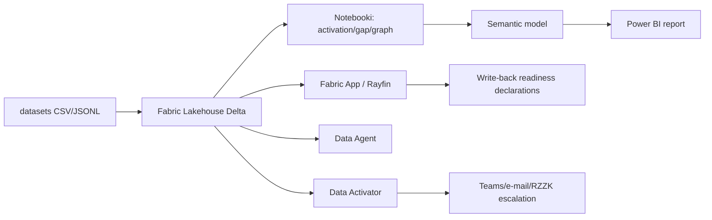

# 🛡️ Siatka Bezpieczeństwa – Pulpit Koordynacji

**Microsoft Fabric jako żywa aplikacja operacyjna dla siatki bezpieczeństwa KPZK**

> ⚠️ **Disclaimer** — repozytorium jest fikcyjnym demem technologicznym dla Microsoft Fabric. Dane są w 100% syntetyczne, wygenerowane deterministycznie przez `generate_datasets.py` z `seed=42`. Nie są to dane operacyjne żadnej instytucji, nie zawierają prawdziwych danych osobowych, numerów telefonów ani adresów e-mail. Scenariusz służy wyłącznie edukacji, prezentacji architektury i rozmowie o możliwościach cyfryzacji procesu zarządzania kryzysowego.

---

## Dla kogo jest to demo

Demo jest przygotowane dla decydentów szczebla krajowego: kierownictwa RCB, członków i obsługi RZZK, ministerstw wiodących i współpracujących, zespołów transformacji cyfrowej administracji, architektów danych oraz właścicieli procesów ochrony ludności. Nie jest to system produkcyjny, ale kompletny wzorzec rozmowy: pokazuje, jak z dokumentu statycznego przejść do procesu mierzalnego, odpytywalnego i sterowalnego.

Najważniejszy użytkownik biznesowy to osoba, która w czasie zdarzenia pyta: **„kto za co odpowiada, co już jest gotowe, co jest zablokowane i czy trzeba eskalować do RZZK?”** W wersji papierowej odpowiedź wymaga przeszukiwania tabel, telefonów i ręcznego składania meldunków. W demie odpowiedź powstaje w aplikacji, modelu semantycznym i Data Agencie.

## Kontekst prawny i biznesowy

Demo odwołuje się do logiki ustawy o zarządzaniu kryzysowym: administracja przechodzi przez fazy zapobiegania, przygotowania, reagowania i odbudowy, a odpowiedzialność rośnie od poziomu lokalnego do krajowego. W repozytorium koncentrujemy się na dwóch fazach używanych w siatce bezpieczeństwa: `R` — reagowanie oraz `O` — odbudowa. Perspektywa jest krajowa: RCB, RZZK i ministerstwa.

Problem biznesowy jest prosty: siatka bezpieczeństwa w PDF/Excel jest poprawna formalnie, ale w sytuacji presji czasu nie odpowiada jak aplikacja. Nie wie, czy dział już potwierdził gotowość, nie wykrywa automatycznie przekroczenia SLA, nie pokazuje przeciążenia działu wiodącego i nie zamienia procedury SPO-1 w listę osób do zaproszenia. Ten projekt demonstruje, jak Microsoft Fabric może być warstwą integrującą dane referencyjne, analizę, raportowanie, aplikację write-back, agenta danych i reguły alertowe.

## Scenariusz osiowy

Scenariusz demo to **„POWÓDŹ WRZESIEŃ”**: zagrożenie `Z02 Powódź`, faza `R`, skala `4`, oś czasu `D-1…D+10`. Wygenerowany plan aktywacji zawiera **44 zadań** i **5 modułów** w kolejności zależności: `{'1': 1, '2': 2, '4': 3, '5': 4, '7': 5}`. Analiza luk pokazuje **28 zadań bez pełnej gotowości**, **28 po SLA**, **9 blokad** oraz przeciążone działy wiodące: `VIII` i `XIX` po 5 zadań wiodących.

## Architektura rozwiązania



Warstwa danych zawiera słowniki KPZK, działy administracji, moduły zadaniowe, kanoniczną siatkę bezpieczeństwa, SPO, kontakty oraz zdarzenia aktywacji i gotowości. Notebooki tworzą plan zadań, analizę luk i graf odpowiedzialności. Model semantyczny zasila raport Power BI, a Fabric App daje operatorom możliwość potwierdzenia gotowości lub zgłoszenia blokady. Data Agent odpowiada językiem naturalnym, a Activator zamienia reguły SLA i blokad w powiadomienia.

## Zawartość repozytorium

```text
ol-siatka-bezpieczenstwa\
├── README.md                         # Ten opis
├── ARCHITECTURE.md                   # Architektura warstwa po warstwie
├── DATA_MODEL.md                     # Pełny słownik danych
├── SETUP_FABRIC.md                   # Instrukcja wdrożenia demo w Fabric
├── DEMO_SCRIPT.md                    # Scenariusz prowadzenia demo 15–20 min
├── generate_datasets.py              # Generator deterministyczny seed=42
├── simulate_realtime.py              # Tryb dry-run zdarzeń aktywacji
├── datasets\                         # Dane wygenerowane i wyniki walidacji
├── notebooks\                        # Notebooki .py z komórkami # CELL
├── semantic-model\                   # Model gwiazdy i miary DAX
├── report\                           # Specyfikacja raportu Power BI
├── fabric-app\                       # Specyfikacja aplikacji i prompt Rayfin
├── ai\                               # Konfiguracja Data Agent
├── activator\                        # Reguły Data Activator
└── kql\                              # Zapytania KQL/SQL dla raportu i agenta
```

## Rzeczywiste liczby rekordów

| Plik | Rekordy |
|---|---:|
| `dim_hazard.csv` | 20 |
| `dim_admin_division.csv` | 25 |
| `dim_task_module.csv` | 7 |
| `fact_safety_grid.csv` | 1000 |
| `dim_spo.csv` | 16 |
| `fact_spo_checklist.csv` | 64 |
| `dim_contact_point.csv` | 25 |
| `fact_readiness_declaration.jsonl` | 106 |
| `fact_task_activation.jsonl` | 79 |
| `fact_interdependency.csv` | 7 |

## Szybki start lokalny (Windows / PowerShell)

```powershell
cd C:\repos\OchronaLudnosci\ol-siatka-bezpieczenstwa
python generate_datasets.py
python notebooks\02_activation_engine.py Z02 R 4
python notebooks\03_gap_analysis.py
python notebooks\04_graph_view.py
python simulate_realtime.py --dry-run --speed 100
```

Oczekiwany wynik: `datasets\derived\activation_plan_Z02_R.csv` z **44 zadaniami**, `gap_analysis_summary.json` z **9 blokadami**, `responsibility_graph.json` z **12 węzłami** i **20 krawędziami** oraz `realtime_dry_run.jsonl` jako offline replay.

## Mapowanie na funkcje Microsoft Fabric

| Funkcja Fabric | Rola w demie |
|---|---|
| Lakehouse / Delta | Przechowuje słowniki, fakty, statusy gotowości i wyniki analiz. |
| Notebooki | Generują plan aktywacji, analizę luk, ścieżkę krytyczną i graf odpowiedzialności. |
| Direct Lake semantic model | Warstwa wspólna dla Power BI, aplikacji i agenta. |
| Power BI | Widok decyzyjny: matryca ryzyka, siatka, postęp aktywacji, luki. |
| Fabric Apps / Rayfin | Główny element demo: interfejs operatora, write-back, eskalacja. |
| Data Agent | Odpowiedzi NL na pytania o odpowiedzialność, blokady, SLA i SPO. |
| Data Activator | Reguły: SLA, brak deklaracji, blokada na ścieżce krytycznej, przeciążenie działu. |
| OneLake | Współdzielenie tych samych tabel między raportem, aplikacją i agentem. |

## Jak czytać demo

Najpierw pokaż `DEMO_SCRIPT.md`: prowadzi prezentera krok po kroku, zawiera kwestie do wypowiedzenia, kliknięcia i liczby. Następnie użyj `SETUP_FABRIC.md` jako checklisty technicznej. `DATA_MODEL.md` odpowiada na pytania o wiarygodność danych, `fabric-app/APP_SPEC.md` i `RAYFIN_PROMPT.md` służą do wygenerowania aplikacji, a `kql/` zawiera zapytania do raportu i Data Agenta.

## Licencja

[MIT](LICENSE)
